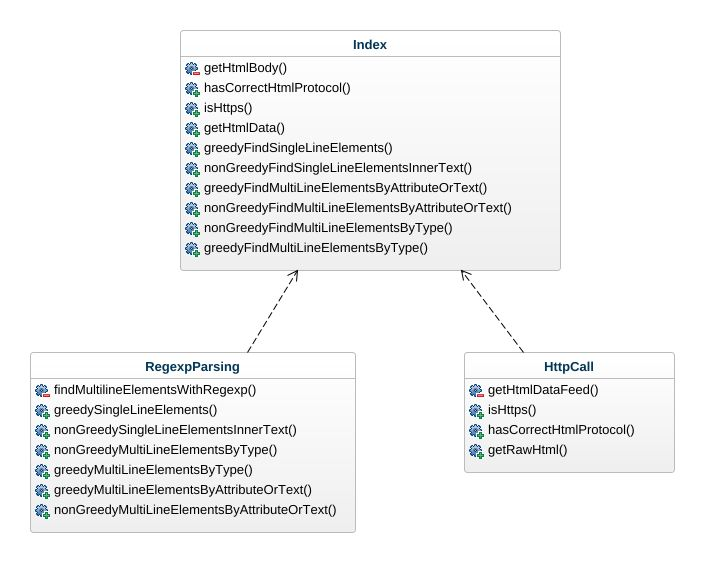

# Mall för inlämning laboration 1, 1dv610

> This file is here for school project reflection and will be removed in later versions

​
## Checklista
  - [x] Jag har skrivit all kod och reflektioner själv. Jag har inte använt mig av andras kod för att lösa uppgiften.
  - [x] Mina testresultat är skrivna utifrån utförd testning ( och inte teoretiskt: "det bör fungera" :) )
  - [x] Koden är objektorienterad
  - [x] Jag har skrivit en modul som riktar sig till programmerare
​
## Egenskattning och mål
  - [ ] Jag är inte klar eftersom jag vet att jag saknar något. (Då skall du inte lämna in! Lämna då istället in på restlaboration.)
  - [x] Jag eftersträvar med denna inlämning godkänt betyg (E-D)
    - [x] De flesta testfall fungerar
    - [x] Koden är förberedd på Återanvändning
    - [x] All kod samt historik finns i git 
    - [x] Kodkvaliterskraven är ifyllda
    - [x] Reflektion är skriven utifrån bokens kapitel 
  - [x] Jag eftersträvar med denna inlämning högre betyg (C-B) och anser mig uppfylla alla extra krav för detta. 
    - [x] Samtliga testfall är skrivna    
    - [x] Testfall är automatiserade
    - [x] Det finns en tydlig beskrivning i hur modulen skall användas (i git)
    - [x] Kodkvalitetskraven är varierade 
  - [ ] Jag eftersträvar med denna inlämning högsta betyg (A) 
​
Förtydligande: Examinator kommer sätta betyg oberoende på vad ni anser. 
​
## Återanvändning
>Beskriv hur du anpassat din kod och instruktioner för att någon annan programmerare skall kunna använda din modul. Om du skrivit instruktioner för din användare, länka till dessa. Om inte, beskriv här hur någon skall göra för att använda din modul.

Jag har gjort modulen så att den går att installera som ett npm paket i andra applikationer.
Man importerar metoderna som en es6 modul det finns en [README.md](https://github.com/BunnyCode/element-scraper/blob/main/README.md) fil där man kan se vilka metoder som finns tillgängliga, samt ett par exempel hur man använder dem.
​
## Beskrivning av min kod
>Beskriv din kod på en hög abstraktionsnivå. En kort beskrivning av dina viktigaste klasser och metoder. Skapa gärna ett klassdiagram som bild. Använd det ni lärt er så här långt i 1dv607. Kommunicera så att jag kan förstå.

dist/index.js är huvud filen som sen använder sig av hjälpmetoder, i klasserna HttpCall och RegexpParsing
Tanken är att klassernas namn ska vara den logiska uppdelningen av funktionallitet. All logik är flyttad till dessa klasser, detta gör att index blir lättare att läsa, samt blandar man inte logik och uttryck i samma klass.
Index "klassen" exportar sen alla funtioner som går att använda.

Funktionen getHtmlData, måste köras först. Denna använder man sen för att kunna ta ut de mönster man vill ha.
Dom viktigaste regex metoderna är nonGreedy single och multiline som hjälper till att begränsa data man vill filtrera på.

Sen kommer nonGreedySingleElementsInnerText som ser till att man kan plocka ut texten man är intresserad av. Då man kan kombinera denna med andra metoder, går det att få ut i prinsip vilken text man vill.
​
## Hur jag testat
>Beskriv hur du kommit fram till om din kod fungerar.
​

Jag har gjort körningar med **npm run test** som startar [Test appen](https://github.com/BunnyCode/element-scraper/tree/main/function-test-app) mot en github page sida.
https://bunnycode.github.io/element-scraper/

Då denna sida inte ändras kan resultaten veriferias mellan varje förändring / itteration. Ska den uppdateras så kommer det endast tillkomma mer komplexa strukturer.
När jag gjorde om greedy och non greedy funktionerna, så var detta viktigt för att se att man fick förväntade resultat.

Tanken var att köra med testramverk, men då det tog mer tid än jag tänkt mig så lät jag skriva metod anrop som ger en gämförelseutskrift.

Detta är inte optimalt men fungerar i ett första skede, det låter mig dess utom testa allting på samma sätt varje gång.

### Testfall
>Lista de enskilda testfallen. **Fetmarkera** sådant som du själv fyllt i. En rad per testfall. Om ni använder vertyg för testning kan ni ha en bild här med testrapporten. Tänk på att kommunicera till mig. Vad fungerar?, vad fungerar inte? Hur är det testat? Vilka delar testas inte?

​
Se testreport för output

| Vad testas                                  | input                                         | output        | utfall PASS/FAIL |
| ------------------------------------------- | --------------------------------------------- | ------------- | ---------------- |
| Korrekt protokoll (http eller https)        | adress med ftp                                | false         | PASS             |
| Korrekt protokoll (http eller https)        | adress med https                              | true          | PASS             |
| ftp protokoll mot isHttps                   | adress med ftp                                | false         | PASS             |
| http adress mot negerad (!isHttps)          | adress med http - http://dummy.com            | true          | PASS             |
| http adress                                 | adress med http - http://dummy.com            | false         | PASS             |
| https adress                                | https://bunnycode.github.io/element-scraper/  | true          | PASS             |
| parse element med id inner2                 | https://bunnycode.github.io/element-scraper/  | \
This is inner 2\</div\>\</div\>          | PASS             |
| nonGreedyFindSingleLineElementsInnerText    | (matches, true)                               | [ 'This is inner 2', '' ]          | PASS             |
| nonGreedyFindSingleLineElementsInnerText    | (matches, false) boolean är find empty        | [ 'This is inner 2' ]          | PASS             |
| nonGreedyFindMultiLineElementsByType        | (testData, 'tr')  elementet tr                | array med TR element | PASS             |
| greedyFindMultiLineElementsByAttributeOrText| (testData, 'end')  klassen end                | array med div        | PASS             |
​

För de sista 3 testerna se [testrapporten](https://github.com/BunnyCode/element-scraper/blob/main/testreport.md), då de inte får plats i tabellen på ett bra sätt.
​
## Kodkvalitetskrav
​
>**Fetmarkera** de "regler" som används ur CC. Ni kan frångå tabellformat om ni vill. Skapa direktlänkar till er kod där det är lämpligt. Skriv så att jag kan förstå.
​

**Dont Be Cute**, namnen ska vara tydlig och inte kräva kulturella refferenser eller slang.
**Short**, alla metoder ska vara så korta det går, utan att dom blir oläsliga. 
**Descriptiv names**, alla funktions/metodnamn försöker förklar vad som kommer hända, utan att man läser jsdoc.
**Domän namn**, variabel och metodnamn passar i den kontext de används. tillexempel Element är vanligt i web sammanhang.
**Do one thing**, metoderna gör en sak, som överrensstämmer med namet. Det går inte att extrahera extra funktioner ifrån dem.
Ett undantag finns här, för att plocka ut "tomma texter" bland elementen. Denna del bör eventuellt skrivas om.
**No Sideffects** funktionerna gör det dom säger att dom ska göra. Dom ändrar inte andra delar i applikationen.
**Command Query Separation**, alla metoder ger data tillbaka, altså svarar på input. Inga publika metoder gör förändringar.
**Stepdown Rule**, funktionerna kommer i en ordning som gör att man kan läsa dem lätt. (i parser klassen finns en helper metod)
**Function arguments**, Så få argument som möjligt. Har gjort ett par vändor där jag plockat bort "onödiga" argument.
**DRY**, dom metoder som kan dela funtionallitet använder en helper metod för detta.

### Namngivning
​
| Namn och förklaring  | Reflektion                                   |
| -------------------  | ---------------------------------------------|
| isHttps                                 | **Method name** "is" i namnet läser som en fråga och vi kan förvänta oss sannt eller falsk |
| getHtmlData    | **Method Names** Här kanske det hade varit värt att byta Data till något som inte går att missförså, vad menas med data i denna metod? Body, request header? **DRY** Metoden använder sig av hjälpare som gör andra saker, dock gör denna endast på en sak oavsett om det är http eller https|
| hasCorrectHtmlProtocol    | **Method Names** "Has" kan ju eventuellt bytas till "is" för att vara enhetligt med isHttps. |
| nonGreedyFindMultiLineElementsByType    | **Domain Names** Elements och multiline är kända uttryck från webutveckling|
| RegexpParsing    | **Function arguments**, här skulle man ju vela dra ner antalet argument till ett. Efter som man skapar en ny instans av regexpParsern hade man kunnat skicka med data där, därment undvika att man skickar arguementen i fel ordning. Detta hade eventuellt krävt att man skriver om Index till en klass vilket har andra problem.|
​
### Funktioner
​
| Metodnamn och förklaring            | Antal rader | Reflektion                                   |
| ----------------------------------- | ----------- | ---------------------------------------------|
| getRawHtml                          | 17          | **niladic** metoden har inga argument i sig utan får dessa genom instansen av klassen som skapas. **Do one thing**, metoden gör egentligen 2 saker först kollar den om det är https eller inte sen hämtar den data, men med hjälp av en helper metod.|
| nonGreedySingleLineElementsInnerText| 9           | **dyadic** Metoden tar 2 argument men hade antagligen kunnat initialiseras när ett klassen skapas. **Use Descriptive names** Metoden beskriver presis vad den ska göra med sitt namn|
| hasCorrectHtmlProtocol              | 8           | **monadic** Metoden tar ett argument, men även här hade det kunnat initeras med URL när man skapar klassen|
| greedySingleLineElements            | 8           | **Short** metoden gör något anorlunda än de andra som kan dela på kod genom en hjälpmetod. Detta kunde gjorts om till en mer generll hjälpfunktion|
| findMultilineElementsWithRegexp     | 7           | **Stepdown Rule**, hjälpmetoden ligger direkt efter de 2 metoder som använder samma kod, med olika regex strängar. Vilket gör att den läser uppeifrån och ner. **DRY** eftersom två andra metoder gör samma anrop så samlar jag algoritmen på ett ställe.  |
​
## Laborationsreflektion
> Reflektera över uppgiften utifrån ett kodkvalitetsperspektiv. Använd begrepp ifrån boken. 

Det är relativt svårt att hitta bra och korta namn till en funktion. Men beskrivande namn hjälper till, altså "descriptive names".
En sak som slog mig var att det kan vara svårt om man har flera metoder, som har nonGreedy eller greedy i början.
Dessa namn har en tendens att likna varandra i camelCase. Jag har gjort ett par itterationer för att nå en "pretty much what you expected" känsla.
Jag är medveten om **argument flags** i RegexpParsing klassen kan förbättras med hjälp av konstruktorn, där med dra ner argumentet till ett.